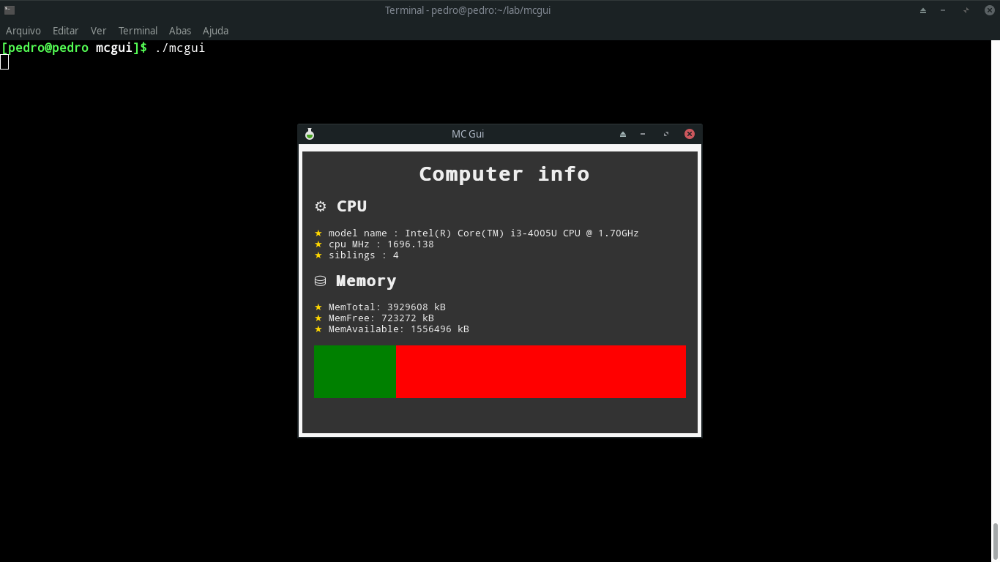

<p align="center">
    
</p>

<h1 align="center">MC GUI</h1>
<p align="center">Memory & Computer Graphical Interface. A bash based client to display memory and computer information</p>

## Getting Started

### Prerequisites
 - linux :^)
 - yad

### Installing
A quick guide to install and use

```
git clone https://github.com/seapvnk/mcgui.git

# maybe you'll need to install yad
<your package manager command to install> yad

# give permissions
sudo chmod 775 mcgui/mcgui

# run 
mcgui/mcgui

```

## Built With

* bash - Script language
* [yad](https://www.mankier.com/1/yad) - GTK+ Dialogs

## Authors

* **Pedro Sérgio** - *Initial work* - [seapvnk](https://github.com/seapvnk)

## License

This project is licensed under the MIT License - see the [LICENSE.md](LICENSE.md) file for details
